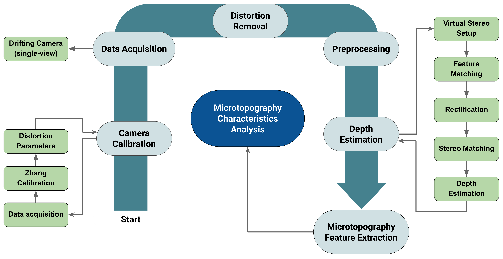
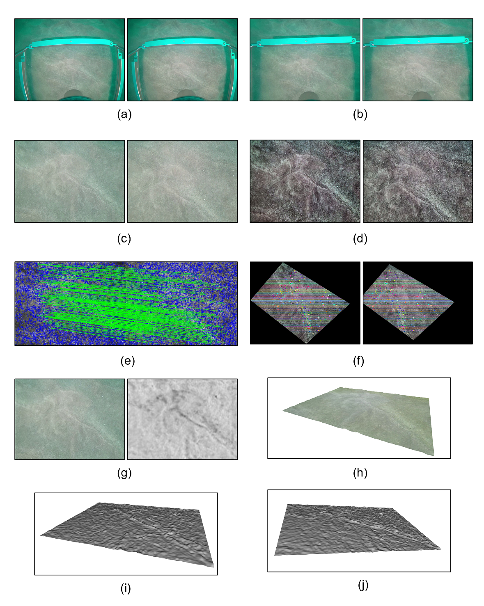

# Zero-Shot Seafloor Sediment Microtopography Characterization Using Stereo from a Drifting Monocular Camera
[View PDF](docs/ACIVS_2025_Sediment_Microtopography.pdf)

High-resolution characterization of seafloor sediment microtopography is essential for understanding benthic habitat structure, sedimentary processes, and ecological function. However, existing methods typically rely on core-based sampling or specialized 3D imaging systems, both of which are limited by cost, complexity, and scalability. In this study, we present a cost-effective, camera-based framework for quantitative sediment surface analysis using video footage from a drifting monocular underwater camera. The method leverages a zero-shot application of [RAFT-Stereo](https://github.com/princeton-vl/RAFT-Stereo) to estimate dense disparity maps from sequential frames without requiring prior training on sediment data. After normalizing disparities, we apply surface detrending and extract statistical and morphological roughness features. Through a small-scale case study, we evaluate the method on two distinct sediment types, Sand and Shell-Hash, and demonstrate that the extracted features effectively capture surface complexity. Additionally, we assess the pipeline’s consistency using overlapping samples acquired with different virtual stereo baselines, showing that key global features remain robust despite variations in camera motion. This framework offers a scalable, non-invasive solution for retrospective and in-situ sediment analysis in marine monitoring.

The pipeline comprises six main components: camera calibration, data acquisition, distortion removal, preprocessing, depth estimation, and microtopography feature extraction. 




The figure shows depth estimation on the sediment data examples. (a) two sequential video frames as a pair of stereo images, (b) undistorted video frames, (c), selected regions of interest (d) preprocessed frames, (e) feature matching, (f) stereo rectification results, (g) the first/left frame and the corresponding depth map computed using RAFT-Stereo. We also provide 3D meshes constructed from the depth map in (h)-(j) for visualization purposes


<p float="left">
  
  
</p>

## Usage 
### Preparation 
```bash
git clone https://github.com/shahrokh1106/sediment-microtopography-monocamera.git
cd sediment-microtopography-monocamera
python -m venv sediment_env
sediment_env\Scripts\activate
pip install -r requirements.txt
```
Raft-Stereo needs Pytorch. Depending on the GPU capability of your system, you can install it from https://pytorch.org/get-started/locally/

### Run
Run *test.py* to get the microtopography features from a pair of sequential frames as an example. The results will be saved in the "example" folder

Run *experiments.py* to get the same results in the paper from two sediment types. The results will be saved in the "dataset" folder


## Citation 
If you find this project useful, please consider citing:
```bash
To be added soon...
and
@article{azhar2022rgb,
  title={An RGB-D framework for capturing soft-sediment microtopography},
  author={Azhar, Mihailo and Hillman, Jenny R and Gee, Trevor and Schenone, Stefano and van der Mark, Wannes and Thrush, Simon F and Delmas, Patrice},
  journal={Methods in Ecology and Evolution},
  volume={13},
  number={8},
  pages={1730--1745},
  year={2022},
  publisher={Wiley Online Library}
}
```
