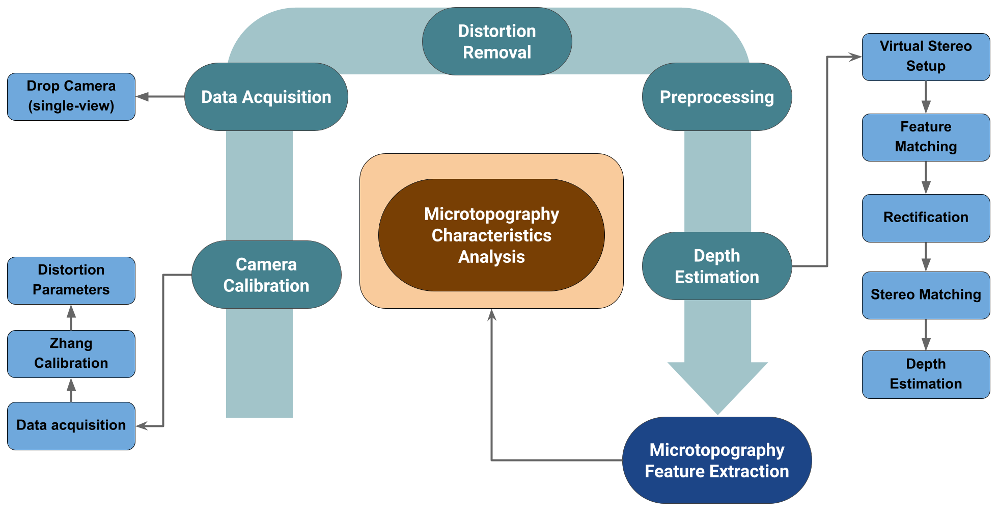
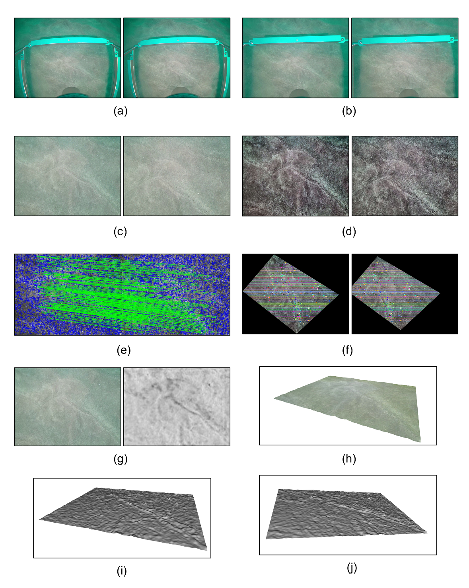

# Zero-Shot Seafloor Sediment Microtopography Characterization Using Stereo from a Drifting Monocular Camera
High-resolution characterization of seafloor sediment microtopography is essential for understanding benthic habitat structure, sedimentary processes, and ecological function. However, existing methods typically rely on core-based sampling or specialized 3D imaging systems, both of which are limited by cost, complexity, and scalability. In this study, we present a cost-effective, camera-based framework for quantitative sediment surface analysis using video footage from a drifting monocular underwater camera. The method leverages a zero-shot application of RAFT-Stereo to estimate dense disparity maps from sequential frames without requiring prior training on sediment data. After normalizing disparities, we apply surface detrending and extract statistical and morphological roughness features. Through a small-scale case study, we evaluate the method on two distinct sediment types, Sand and Shell-Hash, and demonstrate that the extracted features effectively capture surface complexity. Additionally, we assess the pipeline’s consistency using overlapping samples acquired with different virtual stereo baselines, showing that key global features remain robust despite variations in camera motion. This framework offers a scalable, non-invasive solution for retrospective and in-situ sediment analysis in marine monitoring.

The pipeline comprises six main components: camera calibration, data acquisition, distortion removal, preprocessing, depth estimation, and microtopography feature extraction. 

The Python files *DepthMono.py* and *utilities.py* implement the necessary steps to get depths from sequential frames. In *DepthMono.py*

* *OutPutSize* is the size of input images after distortion removal and preprocessing steps. If SuperGlue model is used for the feature matching,  *OutPutSize* must be (640,480)
* *PreProcessFlag* is a flag to set whether preprocessing is needed. If True, Zero-cross normalization followed by Adaptive Histogram Equalization will be applied to the input images.
* *DistCoef* is the distortion parameters estimated from the calibration part. The initial values in the code are related to the drop camera we used.
* *CameraMatrix* is the camera matrix estimated from the calibration step
* *MatchingModel* loads the feature matching model (SuperGlue)
* *DispModelPath* is the disparity estimation model path; we use CREStere model

After getting disparity maps from the input video, the conversion to the depth map is trivial, using the calibration parameters. Next, microtopography surface analysis is applied to the depth maps using detrending approach where a plane is fitted to through the depth surfaces. The below shows an example. 

